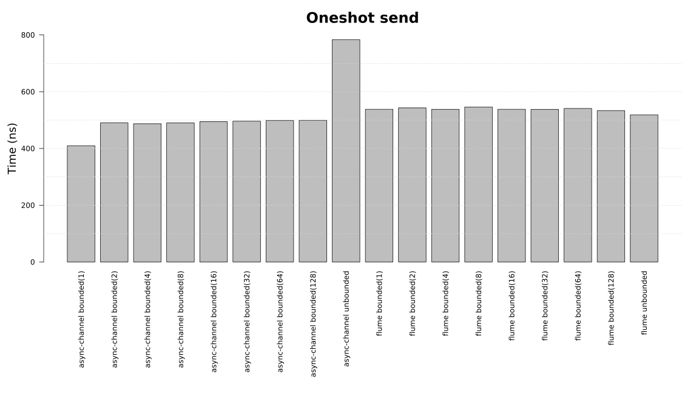
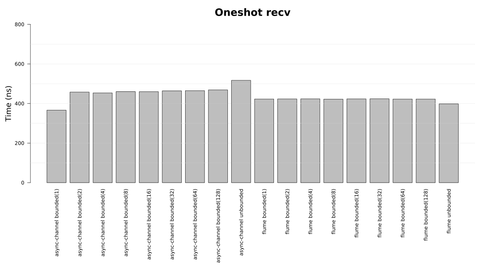
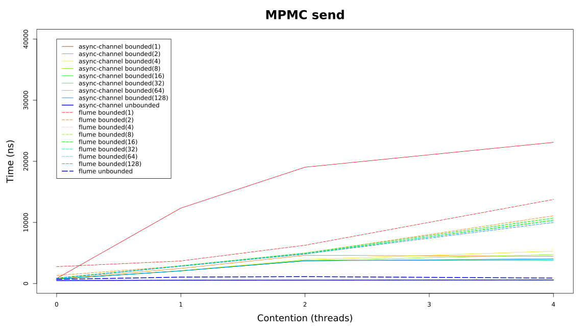
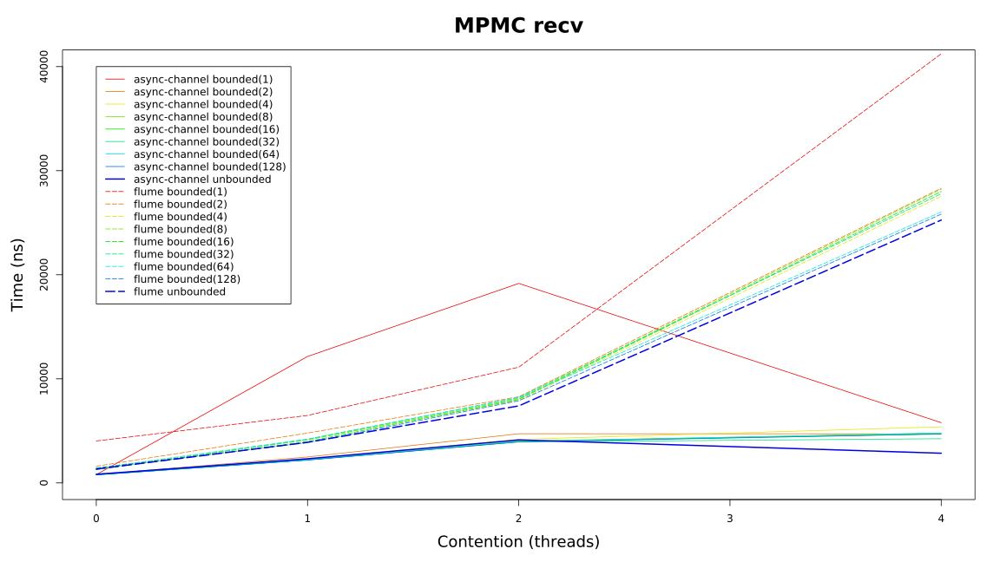

# Async Channel Benchmarks

Run `cargo run -- --bench` to run the benchmarks. Run `cd process` and `cargo run` to process the
data and put it into the `data` directory. Run `plot.R` in the `plots` folder to generate the plot
SVGs.
